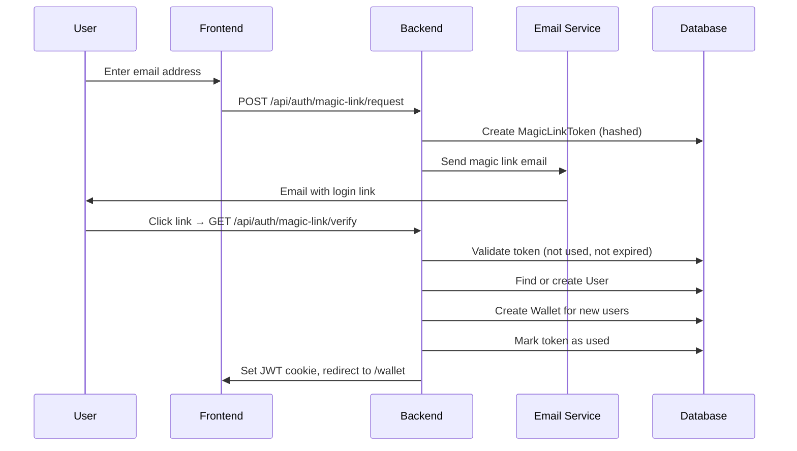
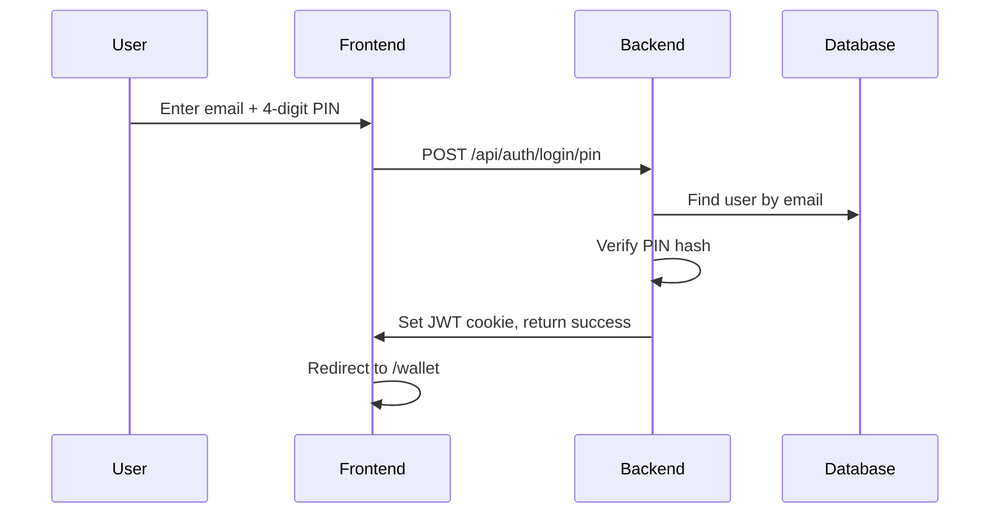

# OTP Authentication Guide: Passwordless Magic Link & PIN

This guide provides a comprehensive walkthrough for implementing passwordless OTP-based authentication in a Next.js application. It covers a frictionless "magic link" login flow, optional PIN-based quick login, database schema, backend API routes, email integration, token management, and frontend implementation.

## Table of Contents

1. [Overview & Authentication Flow](#1-overview--authentication-flow)
2. [Prerequisites & Environment Setup](#2-prerequisites--environment-setup)
3. [Database Schema](#3-database-schema)
4. [JWT Token Management](#4-jwt-token-management)
5. [Email Service Setup](#5-email-service-setup)
6. [Backend API Implementation](#6-backend-api-implementation)
7. [Frontend Implementation](#7-frontend-implementation)
8. [Error Handling](#8-error-handling)
9. [Security Best Practices](#9-security-best-practices)

---

## 1. Overview & Authentication Flow

This implementation provides a **frictionless, passwordless authentication** experience. Users never need to remember or create passwords.

### Magic Link Flow (Primary Method)



### PIN Login Flow (Quick Access)

For returning users who have set up a PIN, they can use it for faster access:



### Key Features

- **Zero Passwords**: Users authenticate via email link—no password to remember
- **Automatic Account Creation**: New users are created automatically on first login
- **Wallet Provisioning**: New users get a wallet created automatically
- **Session Persistence**: Optional "Keep me signed in" for extended sessions
- **PIN Quick Access**: Optional PIN setup for faster subsequent logins
- **Secure Tokens**: All tokens are hashed before storage

---

## 2. Prerequisites & Environment Setup

### Environment Variables

Ensure the following variables are set in your `.env` file:

```env
# Database
MONGODB_URI=mongodb+srv://...

# JWT Secret
ACCESS_TOKEN_SECRET=your-super-secret-jwt-key-at-least-32-characters

# Application URL
NEXT_PUBLIC_APP_URL=http://localhost:3000  # Production: https://yourdomain.com

# Email Provider (choose one: 'nodemailer', 'zeptomail', or 'resend')
EMAIL_PROVIDER=resend

# Nodemailer (Gmail)
MAIL_USER=your-email@gmail.com
MAIL_PASS=your-app-password

# ZeptoMail
ZOHO_KEY=your-zeptomail-api-key

# Resend
RESEND_API_KEY=re_...

# Branding
APP_NAME=Your App Name
MAIL_LOGO=https://yourdomain.com/logo.png
```

### Dependencies

Install the required packages:

```bash
npm install mongoose jsonwebtoken crypto nodemailer resend zeptomail input-otp motion
```

**TypeScript Types:**

```bash
npm install -D @types/jsonwebtoken
```

You'll also need a custom type declaration for ZeptoMail:

**`types/zeptomail.d.ts`**

```typescript
declare module "zeptomail" {
  interface MailResponse {
    message?: string;
    data?: {
      request_id: string;
    };
    messageId?: string;
  }

  interface SendMailClientConfig {
    url: string;
    token: string;
  }

  export class SendMailClient {
    constructor(config: SendMailClientConfig);
    sendMail(payload: Record<string, unknown>): Promise<MailResponse>;
    sendMailWithTemplate(
      payload: Record<string, unknown>
    ): Promise<MailResponse>;
  }
}
```

---

## 3. Database Schema

We use MongoDB with Mongoose. The authentication system requires two primary models.

### User Model (`models/User.ts`)

Stores user information and optional PIN for quick login.

```typescript
import { Schema, model, models, Document } from "mongoose";

export interface User {
  email: string;
  firstName?: string;
  lastName?: string;
  createdAt: Date;
  pushSubscription?: {
    endpoint: string;
    keys: {
      p256dh: string;
      auth: string;
    };
  };
  tag?: string;
  beneficiaries?: {
    userId: string;
    lastTransactionAt: Date;
  }[];
  pin?: string; // Stored as SHA-256 hash
  preferences?: {
    font: string;
    themeColor: string;
  };
}

export interface UserDocument extends User, Document {}

const UserSchema = new Schema({
  email: { type: String, required: true, unique: true },
  firstName: { type: String },
  lastName: { type: String },
  tag: { type: String, unique: true, sparse: true },
  pin: { type: String }, // Hashed PIN
  createdAt: { type: Date, default: Date.now },
  preferences: {
    font: { type: String, default: "atkinsonHyperlegible" },
    themeColor: { type: String, default: "blue" },
  },
  pushSubscription: {
    endpoint: { type: String },
    keys: {
      p256dh: { type: String },
      auth: { type: String },
    },
  },
  beneficiaries: [
    {
      userId: { type: Schema.Types.ObjectId, ref: "User" },
      lastTransactionAt: { type: Date, default: Date.now },
    },
  ],
});

// Hot reload fix for development
if (process.env.NODE_ENV === "development") {
  if (models.User) {
    delete models.User;
  }
}

export const User = models.User || model<User>("User", UserSchema);
```

### MagicLinkToken Model (`models/MagicLinkToken.ts`)

Stores hashed magic link tokens with expiration.

```typescript
import mongoose, { Schema, model, models } from "mongoose";

const MagicLinkTokenSchema = new Schema({
  email: { type: String, required: true },
  tokenHash: { type: String, required: true },
  expires: { type: Date, required: true },
  used: { type: Boolean, default: false },
  keepSignedIn: { type: Boolean, default: false },
});

export const MagicLinkToken =
  models.MagicLinkToken || model("MagicLinkToken", MagicLinkTokenSchema);
```

### Wallet Model (for new user provisioning)

```typescript
import { Schema, model, models } from "mongoose";

const WalletSchema = new Schema({
  userId: { type: Schema.Types.ObjectId, ref: "User", required: true },
  balance: { type: Number, default: 0 },
  currency: { type: String, default: "NGN" },
  type: { type: String, default: "personal" },
});

export const Wallet = models.Wallet || model("Wallet", WalletSchema);
```

---

## 4. JWT Token Management

### Auth Utility (`lib/auth.ts`)

Handles JWT signing, verification, and current user retrieval from cookies.

```typescript
import jwt, { JwtPayload, SignOptions } from "jsonwebtoken";
import { cookies } from "next/headers";

const ACCESS_SECRET = process.env.ACCESS_TOKEN_SECRET || "access-secret";

export interface UserPayload extends JwtPayload {
  userId: string;
  email: string;
}

/**
 * Sign a JWT token with user payload
 * @param payload - User ID and email
 * @param expiresIn - Token expiration (default: 3h, use seconds for "keep signed in")
 */
export function signToken(
  payload: Omit<UserPayload, "iat" | "exp">,
  expiresIn: SignOptions["expiresIn"] = "3h"
) {
  return jwt.sign(payload, ACCESS_SECRET, { expiresIn });
}

/**
 * Verify and decode a JWT token
 * @param token - The JWT token string
 * @returns Decoded payload or null if invalid
 */
export function verifyToken(token: string): UserPayload | null {
  try {
    return jwt.verify(token, ACCESS_SECRET) as UserPayload;
  } catch (e) {
    return null;
  }
}

/**
 * Get current authenticated user from cookies (server-side)
 * @returns User payload or null if not authenticated
 */
export async function getCurrentUser() {
  const cookieStore = await cookies();
  const token = cookieStore.get("token")?.value;

  if (!token) return null;

  return verifyToken(token);
}
```

---

## 5. Email Service Setup

The email service supports multiple providers (Nodemailer, ZeptoMail, Resend) with a unified interface.

### Email Service (`lib/email.ts`)

This is a comprehensive email service. Below are the essential parts for magic link authentication:

```typescript
import nodemailer, { Transporter, SendMailOptions } from "nodemailer";
import { SendMailClient } from "zeptomail";
import { Resend } from "resend";

// Environment variables
const APP_NAME = process.env.APP_NAME || "Your App";
const MAIL_USER = process.env.MAIL_USER;
const MAIL_PASS = process.env.MAIL_PASS;
const MAIL_LOGO = process.env.MAIL_LOGO || "https://via.placeholder.com/48";
const ZOHO_KEY = process.env.ZOHO_KEY;
const RESEND_API_KEY = process.env.RESEND_API_KEY;
const DEFAULT_MAIL_PROVIDER = process.env.EMAIL_PROVIDER || "nodemailer";

// Interfaces
export interface EmailOptions {
  subject: string;
  htmlBody: string;
  textBody?: string;
  to: { email: string; name?: string } | { email: string; name?: string }[];
  from?: { email: string; name?: string };
}

export interface EmailResult {
  success: boolean;
  messageId?: string;
  error?: string;
}

// Main Email Service Class
export class EmailService {
  private provider: any;
  private defaultFromEmail: string;
  private defaultFromName: string;

  constructor(
    providerType:
      | "nodemailer"
      | "zeptomail"
      | "resend" = DEFAULT_MAIL_PROVIDER as any
  ) {
    this.defaultFromEmail = MAIL_USER || "hello@example.com";
    this.defaultFromName = APP_NAME || "Notification Service";

    switch (providerType) {
      case "resend":
        this.provider = new Resend(RESEND_API_KEY);
        break;
      case "zeptomail":
        this.provider = new SendMailClient({
          url: "api.zeptomail.com/",
          token: ZOHO_KEY || "",
        });
        break;
      default:
        this.provider = nodemailer.createTransport({
          service: "gmail",
          auth: { user: MAIL_USER, pass: MAIL_PASS },
        });
    }
  }

  async sendEmail(options: EmailOptions): Promise<EmailResult> {
    // Implementation varies by provider - see full lib/email.ts
    // Returns { success: boolean, messageId?: string, error?: string }
  }

  /**
   * Generate beautiful minimalist email template
   */
  generateMinimalistTemplate(options: {
    title: string;
    content: string;
    buttonText?: string;
    buttonUrl?: string;
  }): string {
    const { title, content, buttonText, buttonUrl } = options;

    const buttonHtml =
      buttonText && buttonUrl
        ? `
      <div style="text-align: left; margin: 28px 0;">
        <a href="${buttonUrl}" style="display: inline-block; padding: 14px 32px; background-color: #0091cf; color: #c1e8ff; text-decoration: none; border-radius: 100px; font-weight: 500; font-size: 15px;">${buttonText}</a>
      </div>
    `
        : "";

    return `
    <!DOCTYPE html>
    <html lang="en">
    <head>
      <meta charset="UTF-8">
      <meta name="viewport" content="width=device-width, initial-scale=1.0">
      <title>${title}</title>
    </head>
    <body style="margin: 0; padding: 0; font-family: -apple-system, BlinkMacSystemFont, 'Segoe UI', Roboto, sans-serif; color: #334155; line-height: 1.5; background-color: #f0f9ff;">
      <div style="max-width: 600px; margin: 0 auto; padding: 40px 20px;">
        <div style="text-align: left; margin-bottom: 32px;">
          
        </div>
        
        <div style="background-color: #ffffff; border-radius: 24px; padding: 40px; margin-bottom: 24px; box-shadow: 0 4px 16px rgba(0, 0, 0, 0.03);">
          <h2 style="color: #0c4a6e; font-size: 24px; font-weight: 600; margin-top: 0; margin-bottom: 20px;">${title}</h2>
          ${content}
          ${buttonHtml}
        </div>
        
        <div style="text-align: left; padding-top: 12px; font-size: 14px; color: #94a3b8;">
          <p>© ${new Date().getFullYear()} ${APP_NAME}. All rights reserved.</p>
        </div>
      </div>
    </body>
    </html>
    `;
  }
}

/**
 * Helper function to create styled email buttons
 */
export function createEmailButton(text: string, url: string): string {
  return `
    <div style="text-align: left; margin: 28px 0;">
      <a href="${url}" style="display: inline-block; padding: 14px 32px; background-color: #0091cf; color: #c1e8ff; text-decoration: none; border-radius: 100px; font-weight: 500; font-size: 15px;">${text}</a>
    </div>
  `;
}

/**
 * Send magic link email to user
 */
export async function sendMagicLink(email: string, link: string) {
  const emailService = new EmailService();
  const content = `
    <p>Click the button below to securely login to your account. This link expires in 15 minutes.</p>
    ${createEmailButton("Login to Wallet", link)}
    <p>If you didn't request this login, please ignore this email.</p>
  `;

  const htmlBody = emailService.generateMinimalistTemplate({
    title: "Login to Your Account",
    content,
  });

  await emailService.sendEmail({
    to: { email },
    subject: "Your Magic Login Link",
    htmlBody,
  });
}

// Export singleton instance
export const emailService = new EmailService();
```

---

## 6. Backend API Implementation

### Database Connection (`lib/mongodb.ts`)

```typescript
import mongoose from "mongoose";

const MONGODB_URI = process.env.MONGODB_URI;

if (!MONGODB_URI) {
  throw new Error("Please define the MONGODB_URI environment variable");
}

interface MongooseCache {
  conn: typeof mongoose | null;
  promise: Promise<typeof mongoose> | null;
}

declare global {
  var mongoose: MongooseCache;
}

let cached = global.mongoose;

if (!cached) {
  cached = global.mongoose = { conn: null, promise: null };
}

async function connectToDatabase() {
  if (cached.conn) {
    return cached.conn;
  }

  if (!cached.promise) {
    const opts = {
      bufferCommands: false,
      maxPoolSize: 10,
    };

    cached.promise = mongoose.connect(MONGODB_URI!, opts);
  }

  try {
    cached.conn = await cached.promise;
  } catch (e) {
    cached.promise = null;
    throw e;
  }

  return cached.conn;
}

export default connectToDatabase;
```

### Utility Functions (`lib/utils.ts`)

```typescript
import { clsx, type ClassValue } from "clsx";
import { twMerge } from "tailwind-merge";

export function cn(...inputs: ClassValue[]) {
  return twMerge(clsx(inputs));
}

/**
 * Generate a random alphanumeric tag for new users
 */
export function generateTag(length: number = 6): string {
  const chars = "ABCDEFGHIJKLMNOPQRSTUVWXYZ0123456789";
  let result = "";
  for (let i = 0; i < length; i++) {
    result += chars.charAt(Math.floor(Math.random() * chars.length));
  }
  return result;
}

export const logger = {
  info: (message: string, data?: unknown) => {
    console.log(
      `[INFO] ${new Date().toISOString()} - ${message}`,
      data ? JSON.stringify(data, null, 2) : ""
    );
  },
  error: (message: string, error?: unknown) => {
    console.error(`[ERROR] ${new Date().toISOString()} - ${message}`, error);
  },
  warn: (message: string, data?: unknown) => {
    console.warn(
      `[WARN] ${new Date().toISOString()} - ${message}`,
      data ? JSON.stringify(data, null, 2) : ""
    );
  },
};
```

### API Error Handler (`lib/api-error.ts`)

```typescript
import { NextResponse } from "next/server";
import { logger } from "./utils";

export type ApiErrorResponse = {
  error: string;
  code?: string;
  details?: string[];
};

interface MongooseError {
  name: string;
  code?: number;
  keyValue?: Record<string, unknown>;
  errors?: Record<string, { message: string }>;
}

export function handleApiError(
  error: unknown,
  context: string = "API Error"
): NextResponse<ApiErrorResponse> {
  logger.error(context, error);

  const mongooseError = error as MongooseError;

  // Handle Mongoose duplicate key error
  if (
    mongooseError?.name === "MongoServerError" &&
    mongooseError.code === 11000
  ) {
    const keyValue = mongooseError.keyValue;
    const field = keyValue ? Object.keys(keyValue)[0] : "unknown field";
    return NextResponse.json(
      { error: `Duplicate value for field: ${field}`, code: "DUPLICATE_KEY" },
      { status: 409 }
    );
  }

  // Handle Mongoose validation error
  if (mongooseError?.name === "ValidationError" && mongooseError.errors) {
    const messages = Object.values(mongooseError.errors).map((e) => e.message);
    return NextResponse.json(
      {
        error: "Validation failed",
        details: messages,
        code: "VALIDATION_ERROR",
      },
      { status: 400 }
    );
  }

  // Handle Standard Error
  if (error instanceof Error) {
    return NextResponse.json({ error: error.message }, { status: 500 });
  }

  return NextResponse.json({ error: "Internal server error" }, { status: 500 });
}
```

### Magic Link Request (`app/api/auth/magic-link/request/route.ts`)

Handles requesting a new magic link.

```typescript
import { NextResponse } from "next/server";
import connectToDatabase from "@/lib/mongodb";
import { MagicLinkToken } from "@/models/MagicLinkToken";
import { sendMagicLink } from "@/lib/email";
import crypto from "crypto";
import { logger } from "@/lib/utils";

export async function POST(request: Request) {
  const requestId = crypto.randomUUID();
  logger.info(`[${requestId}] Magic link request started`);

  try {
    const { email, keepSignedIn } = await request.json();
    logger.info(`[${requestId}] Requesting magic link for: ${email}`);

    if (!email) {
      logger.warn(`[${requestId}] Email missing in request`);
      return NextResponse.json({ error: "Email is required" }, { status: 400 });
    }

    await connectToDatabase();

    // Generate secure random token
    const token = crypto.randomBytes(32).toString("hex");
    // Store only the hash (never store plain token)
    const tokenHash = crypto.createHash("sha256").update(token).digest("hex");
    const expires = new Date(Date.now() + 15 * 60 * 1000); // 15 minutes

    // Store token in database
    await MagicLinkToken.create({
      email,
      tokenHash,
      expires,
      keepSignedIn: !!keepSignedIn,
    });

    // Construct magic link with plain token (hash stored in DB)
    const link = `${
      process.env.NEXT_PUBLIC_APP_URL
    }/api/auth/magic-link/verify?token=${token}&email=${encodeURIComponent(
      email
    )}`;

    // Send the email
    await sendMagicLink(email, link);

    logger.info(`[${requestId}] Magic link sent successfully to: ${email}`);
    return NextResponse.json({ success: true, message: "Magic link sent" });
  } catch (error) {
    logger.error(`[${requestId}] Magic link request error`, error);
    return NextResponse.json(
      { error: "Internal server error" },
      { status: 500 }
    );
  }
}
```

### Magic Link Verification (`app/api/auth/magic-link/verify/route.ts`)

Handles verifying the magic link, creating users/wallets, and establishing sessions.

```typescript
import { NextResponse } from "next/server";
import connectToDatabase from "@/lib/mongodb";
import { MagicLinkToken } from "@/models/MagicLinkToken";
import { User } from "@/models/User";
import { Wallet } from "@/models/Wallet";
import { signToken } from "@/lib/auth";
import { generateTag, logger } from "@/lib/utils";
import crypto from "crypto";
import { cookies } from "next/headers";

export async function GET(request: Request) {
  const requestId = crypto.randomUUID();
  logger.info(`[${requestId}] Magic link verification started`);

  try {
    const { searchParams } = new URL(request.url);
    const token = searchParams.get("token");
    const email = searchParams.get("email");

    if (!token || !email) {
      logger.warn(`[${requestId}] Missing token or email in verification link`);
      return NextResponse.redirect(
        new URL("/error?error=Invalid link", request.url)
      );
    }

    await connectToDatabase();

    // Hash the incoming token to compare with stored hash
    const tokenHash = crypto.createHash("sha256").update(token).digest("hex");

    // Find valid, unused, non-expired token
    const magicToken = await MagicLinkToken.findOne({
      email,
      tokenHash,
      used: false,
      expires: { $gt: new Date() },
    });

    if (!magicToken) {
      logger.warn(
        `[${requestId}] Invalid or expired token for email: ${email}`
      );
      return NextResponse.redirect(
        new URL("/error?error=Invalid or expired token", request.url)
      );
    }

    // Mark token as used (prevent replay attacks)
    magicToken.used = true;
    await magicToken.save();

    // Find or create user
    let user = await User.findOne({ email });
    if (!user) {
      logger.info(`[${requestId}] Creating new user for email: ${email}`);

      // Generate a unique tag for the user
      let tag = generateTag();
      let isUnique = false;
      while (!isUnique) {
        const existingUser = await User.findOne({ tag });
        if (!existingUser) {
          isUnique = true;
        } else {
          tag = generateTag();
        }
      }

      user = await User.create({ email, tag });

      // Create wallet for new user
      const existingWallet = await Wallet.findOne({ userId: user._id });
      if (!existingWallet) {
        await Wallet.create({
          userId: user._id,
          currency: "NGN",
          type: "personal",
        });
      }
      logger.info(`[${requestId}] User and wallet created successfully`);
    } else {
      logger.info(`[${requestId}] Existing user logged in: ${user._id}`);
    }

    // Determine session duration
    const maxAge = magicToken.keepSignedIn
      ? 3 * 24 * 60 * 60 // 3 days
      : 60 * 60; // 1 hour

    // Generate JWT
    const jwtToken = signToken({ userId: user._id, email: user.email }, maxAge);

    // Set HTTP-only cookie
    const cookieStore = await cookies();
    cookieStore.set("token", jwtToken, {
      httpOnly: true,
      secure: process.env.NODE_ENV === "production",
      maxAge,
      path: "/",
    });

    logger.info(`[${requestId}] Session established, redirecting to wallet`);
    return NextResponse.redirect(new URL("/wallet", request.url));
  } catch (error) {
    logger.error(`[${requestId}] Magic link verify error`, error);
    return NextResponse.redirect(
      new URL("/error?error=Internal server error", request.url)
    );
  }
}
```

### PIN Login (`app/api/auth/login/pin/route.ts`)

Alternative login method using email + PIN.

```typescript
import { NextResponse } from "next/server";
import connectToDatabase from "@/lib/mongodb";
import { User } from "@/models/User";
import { signToken } from "@/lib/auth";
import crypto from "crypto";
import { cookies } from "next/headers";
import { logger } from "@/lib/utils";
import { handleApiError } from "@/lib/api-error";

export async function POST(request: Request) {
  const requestId = crypto.randomUUID();
  logger.info(`[${requestId}] PIN login attempt`);

  try {
    const { email, pin, keepSignedIn } = await request.json();

    if (!email || !pin) {
      return NextResponse.json(
        { error: "Email and PIN are required" },
        { status: 400 }
      );
    }

    await connectToDatabase();

    const user = await User.findOne({ email });

    if (!user || !user.pin) {
      // Return generic error for security (don't reveal if user exists)
      return NextResponse.json(
        { error: "Invalid credentials" },
        { status: 401 }
      );
    }

    // Hash incoming PIN and compare
    const pinHash = crypto.createHash("sha256").update(pin).digest("hex");

    if (pinHash !== user.pin) {
      return NextResponse.json(
        { error: "Invalid credentials" },
        { status: 401 }
      );
    }

    // Determine session duration
    const maxAge = keepSignedIn
      ? 3 * 24 * 60 * 60 // 3 days
      : 60 * 60; // 1 hour

    // Generate JWT
    const jwtToken = signToken({ userId: user._id, email: user.email }, maxAge);

    // Set cookie
    const cookieStore = await cookies();
    cookieStore.set("token", jwtToken, {
      httpOnly: true,
      secure: process.env.NODE_ENV === "production",
      maxAge,
      path: "/",
    });

    logger.info(`[${requestId}] PIN login successful for user: ${user._id}`);
    return NextResponse.json({ success: true, message: "Login successful" });
  } catch (error) {
    return handleApiError(error, `[${requestId}] PIN login error`);
  }
}
```

### Logout (`app/api/auth/logout/route.ts`)

```typescript
import { cookies } from "next/headers";
import { NextResponse } from "next/server";
import { logger } from "@/lib/utils";

export async function POST() {
  logger.info("Logout request received");
  const cookieStore = await cookies();
  cookieStore.delete("token");
  logger.info("User logged out successfully");

  return NextResponse.json({ success: true });
}
```

---

## 7. Frontend Implementation

### OTP Input Component (`components/ui/input-otp.tsx`)

A beautiful, accessible OTP input component using the `input-otp` library.

```tsx
"use client";

import * as React from "react";
import { OTPInput, OTPInputContext } from "input-otp";
import { MinusIcon } from "lucide-react";
import { cn } from "@/lib/utils";

function InputOTP({
  className,
  containerClassName,
  ...props
}: React.ComponentProps<typeof OTPInput> & {
  containerClassName?: string;
}) {
  return (
    <OTPInput
      data-slot="input-otp"
      containerClassName={cn(
        "flex items-center gap-2 has-disabled:opacity-50",
        containerClassName
      )}
      className={cn("disabled:cursor-not-allowed", className)}
      {...props}
    />
  );
}

function InputOTPGroup({ className, ...props }: React.ComponentProps<"div">) {
  return (
    <div
      data-slot="input-otp-group"
      className={cn("flex items-center", className)}
      {...props}
    />
  );
}

function InputOTPSlot({
  index,
  className,
  masked,
  ...props
}: React.ComponentProps<"div"> & {
  index: number;
  masked?: boolean;
}) {
  const inputOTPContext = React.useContext(OTPInputContext);
  const { char, hasFakeCaret, isActive } = inputOTPContext?.slots[index] ?? {};

  return (
    <div
      data-slot="input-otp-slot"
      data-active={isActive}
      className={cn(
        "data-[active=true]:border-ring data-[active=true]:ring-ring/50 border-input relative flex h-14 w-14 items-center justify-center border-y border-r text-xl shadow-xs transition-all outline-none first:rounded-l-md first:border-l last:rounded-r-md data-[active=true]:z-10 data-[active=true]:ring-[3px]",
        className
      )}
      {...props}
    >
      {masked && char ? "•" : char}
      {hasFakeCaret && (
        <div className="pointer-events-none absolute inset-0 flex items-center justify-center">
          <div className="animate-caret-blink bg-foreground h-4 w-px duration-1000" />
        </div>
      )}
    </div>
  );
}

function InputOTPSeparator({ ...props }: React.ComponentProps<"div">) {
  return (
    <div data-slot="input-otp-separator" role="separator" {...props}>
      <MinusIcon />
    </div>
  );
}

export { InputOTP, InputOTPGroup, InputOTPSlot, InputOTPSeparator };
```

### Login Email Persistence Hook

Store the user's email in localStorage for convenience.

**`hooks/aevr/use-persisted-state.ts`**

```typescript
import { create } from "zustand";
import { createJSONStorage, persist } from "zustand/middleware";

interface PersistedStateOptions {
  storageKey: string;
}

export function usePersistedState<T>(
  initialValue: T,
  options: PersistedStateOptions
) {
  const useStore = create(
    persist<{ state: T; setState: (value: T) => void }>(
      (set) => ({
        state: initialValue,
        setState: (value) => set({ state: value }),
      }),
      {
        name: options.storageKey,
        storage: createJSONStorage(() => localStorage),
      }
    )
  );

  return useStore();
}
```

**`components/UserWrapper.tsx`**

```tsx
"use client";

import { usePersistedState } from "@/hooks/aevr/use-persisted-state";

export const useLoginMail = () => {
  const { state: email, setState: setEmail } = usePersistedState<string>("", {
    storageKey: "login_email",
  });

  return { email, setEmail };
};
```

### Auth Layout (`app/(auth)/layout.tsx`)

```tsx
export default function AuthLayout({
  children,
}: {
  children: React.ReactNode;
}) {
  return (
    <div className="min-h-screen flex items-center justify-center bg-background text-foreground p-4">
      {children}
    </div>
  );
}
```

### Login Page (`app/(auth)/login/page.tsx`)

Complete login page with Magic Link and PIN options.

```tsx
"use client";

import { useState } from "react";
import { motion } from "motion/react";
import { Button } from "@/components/ui/aevr/button";
import { Card } from "@/components/ui/aevr/card";
import { InfoBox } from "@/components/ui/aevr/info-box";
import { useRouter } from "next/navigation";
import {
  InputOTP,
  InputOTPGroup,
  InputOTPSlot,
} from "@/components/ui/input-otp";
import { useLoginMail } from "@/components/UserWrapper";

export default function LoginPage() {
  const { email, setEmail } = useLoginMail();
  const [pin, setPin] = useState("");
  const [loading, setLoading] = useState(false);
  const [sent, setSent] = useState(false);
  const [error, setError] = useState("");
  const [keepSignedIn, setKeepSignedIn] = useState(false);
  const [loginMethod, setLoginMethod] = useState<"magic" | "pin">("magic");
  const router = useRouter();

  const handleSubmit = async (e: React.FormEvent) => {
    e.preventDefault();
    setLoading(true);
    setError("");

    try {
      if (loginMethod === "magic") {
        const res = await fetch("/api/auth/magic-link/request", {
          method: "POST",
          headers: { "Content-Type": "application/json" },
          body: JSON.stringify({ email, keepSignedIn }),
        });

        const data = await res.json();

        if (!res.ok) throw new Error(data.error || "Something went wrong");

        setSent(true);
      } else {
        const res = await fetch("/api/auth/login/pin", {
          method: "POST",
          headers: { "Content-Type": "application/json" },
          body: JSON.stringify({ email, pin, keepSignedIn }),
        });

        const data = await res.json();

        if (!res.ok) throw new Error(data.error || "Invalid credentials");

        router.push("/wallet");
      }
    } catch (err) {
      setError((err as Error).message);
    } finally {
      setLoading(false);
    }
  };

  return (
    <motion.div
      initial={{ opacity: 0, y: 20 }}
      animate={{ opacity: 1, y: 0 }}
      className="w-full max-w-md relative z-10"
    >
      <Card className="bg-card backdrop-blur-xl border-border p-8 shadow-2xl">
        <div className="text-center mb-8">
          <h1 className="text-3xl font-bold text-card-foreground">
            Welcome Back
          </h1>
          <p className="text-muted-foreground mt-2">
            Sign in to access your wallet
          </p>
        </div>

        {sent ? (
          <InfoBox
            type="success"
            title="Check your email"
            description={
              <span>
                We've sent a magic link to{" "}
                <span className="text-foreground font-medium">{email}</span>
              </span>
            }
          />
        ) : (
          <form onSubmit={handleSubmit} className="space-y-6">
            {/* Login Method Toggle */}
            <div className="flex p-1 bg-muted rounded-lg mb-6">
              <button
                type="button"
                onClick={() => setLoginMethod("magic")}
                className={`flex-1 py-2 text-sm font-medium rounded-md transition-all ${
                  loginMethod === "magic"
                    ? "bg-background text-foreground shadow-sm"
                    : "text-muted-foreground hover:text-foreground"
                }`}
              >
                Magic Link
              </button>
              <button
                type="button"
                onClick={() => setLoginMethod("pin")}
                className={`flex-1 py-2 text-sm font-medium rounded-md transition-all ${
                  loginMethod === "pin"
                    ? "bg-background text-foreground shadow-sm"
                    : "text-muted-foreground hover:text-foreground"
                }`}
              >
                PIN
              </button>
            </div>

            {/* Email Input */}
            <div>
              <label className="block text-sm font-medium text-foreground mb-2">
                Email Address
              </label>
              <input
                type="email"
                value={email}
                onChange={(e) => setEmail(e.target.value)}
                className="w-full bg-input border border-border rounded-xl px-4 py-3 text-foreground placeholder-muted-foreground focus:outline-none focus:ring-2 focus:ring-app-theme-500/50 transition-all"
                placeholder="you@example.com"
                required
              />
            </div>

            {/* PIN Input (conditional) */}
            {loginMethod === "pin" && (
              <motion.div
                initial={{ opacity: 0, height: 0 }}
                animate={{ opacity: 1, height: "auto" }}
                exit={{ opacity: 0, height: 0 }}
                className="flex flex-col items-start space-y-2"
              >
                <label className="block text-sm font-medium text-foreground mb-2 self-start">
                  4-Digit PIN
                </label>
                <InputOTP
                  maxLength={4}
                  value={pin}
                  onChange={(value) => setPin(value)}
                >
                  <InputOTPGroup>
                    <InputOTPSlot index={0} masked />
                    <InputOTPSlot index={1} masked />
                    <InputOTPSlot index={2} masked />
                    <InputOTPSlot index={3} masked />
                  </InputOTPGroup>
                </InputOTP>
              </motion.div>
            )}

            {/* Keep Signed In */}
            <div className="flex items-center gap-2">
              <input
                type="checkbox"
                id="keepSignedIn"
                checked={keepSignedIn}
                onChange={(e) => setKeepSignedIn(e.target.checked)}
                className="rounded border-border bg-input"
              />
              <label
                htmlFor="keepSignedIn"
                className="text-sm text-muted-foreground select-none cursor-pointer"
              >
                Keep me signed in for 3 days
              </label>
            </div>

            {/* Error Display */}
            {error && (
              <InfoBox type="error" title="Error" description={error} />
            )}

            {/* Submit Button */}
            <Button
              type="submit"
              disabled={loading}
              className="w-full"
              size="lg"
            >
              {loading ? (
                <span className="flex items-center justify-center gap-2">
                  <svg className="animate-spin h-5 w-5" viewBox="0 0 24 24">
                    <circle
                      className="opacity-25"
                      cx="12"
                      cy="12"
                      r="10"
                      stroke="currentColor"
                      strokeWidth="4"
                      fill="none"
                    />
                    <path
                      className="opacity-75"
                      fill="currentColor"
                      d="M4 12a8 8 0 018-8V0C5.373 0 0 5.373 0 12h4zm2 5.291A7.962 7.962 0 014 12H0c0 3.042 1.135 5.824 3 7.938l3-2.647z"
                    />
                  </svg>
                  {loginMethod === "magic"
                    ? "Sending Link..."
                    : "Logging in..."}
                </span>
              ) : loginMethod === "magic" ? (
                "Send Magic Link"
              ) : (
                "Login with PIN"
              )}
            </Button>
          </form>
        )}
      </Card>
    </motion.div>
  );
}
```

### Error Page (`app/(auth)/error/page.tsx`)

```tsx
"use client";

import { useSearchParams } from "next/navigation";
import { Suspense } from "react";
import { InfoBox } from "@/components/ui/aevr/info-box";

function ErrorContent() {
  const searchParams = useSearchParams();
  const error = searchParams.get("error") || "An unexpected error occurred";

  return (
    <div className="flex flex-col items-center justify-center p-4 max-w-lg w-full">
      <InfoBox
        type="error"
        size="lg"
        title="Authentication Error"
        description={error}
        actions={[
          {
            name: "Back to Login",
            path: "/login",
            type: "primary",
          },
        ]}
      />
    </div>
  );
}

export default function ErrorPage() {
  return (
    <Suspense fallback={<div>Loading...</div>}>
      <ErrorContent />
    </Suspense>
  );
}
```

---

## 8. Error Handling

The error handling strategy covers multiple layers:

### API-Level Errors

- **Validation Errors**: Return 400 with descriptive messages
- **Authentication Errors**: Return 401 with generic "Invalid credentials" (never reveal if user exists)
- **Duplicate Key Errors**: Return 409 for duplicate email/tag
- **Internal Errors**: Return 500 and log full error server-side

### User-Facing Errors

- Display errors in `InfoBox` components with clear, actionable messages
- Redirect to `/error` page for magic link failures
- Show inline errors for form validation

### Token Errors

- **Expired Token**: Redirect to `/error?error=Invalid or expired token`
- **Used Token**: Same as expired (prevent replay attacks)
- **Invalid Token**: Same redirect

---

## 9. Security Best Practices

### Token Security

1. **Hash Before Storage**: Never store plain tokens in the database

   ```typescript
   const tokenHash = crypto.createHash("sha256").update(token).digest("hex");
   ```

2. **Short Expiration**: Magic links expire in 15 minutes

   ```typescript
   const expires = new Date(Date.now() + 15 * 60 * 1000);
   ```

3. **Single Use**: Mark tokens as used immediately after verification
   ```typescript
   magicToken.used = true;
   await magicToken.save();
   ```

### Cookie Security

```typescript
cookieStore.set("token", jwtToken, {
  httpOnly: true, // Prevent XSS access
  secure: process.env.NODE_ENV === "production", // HTTPS only in prod
  maxAge, // Auto-expire
  path: "/", // Available site-wide
});
```

### PIN Security

1. **Hash Storage**: PINs are stored as SHA-256 hashes
2. **Generic Errors**: Never reveal if user or PIN exists
   ```typescript
   if (!user || !user.pin) {
     return NextResponse.json(
       { error: "Invalid credentials" },
       { status: 401 }
     );
   }
   ```

### General Practices

1. **Request ID Logging**: Track all requests with unique IDs for debugging
2. **Rate Limiting**: Consider adding rate limiting to prevent brute force attacks
3. **CSRF Protection**: Next.js provides built-in CSRF protection for API routes
4. **Environment Variables**: Never commit secrets to version control

---

## Summary

This authentication system provides:

- ✅ **Frictionless onboarding** - No passwords, just email
- ✅ **Automatic account creation** - Users are created on first login
- ✅ **Wallet provisioning** - New users get wallets automatically
- ✅ **Two login methods** - Magic link (primary) and PIN (quick access)
- ✅ **Session persistence** - "Keep me signed in" option
- ✅ **Secure token handling** - Hashed storage, single-use, short expiration
- ✅ **Beautiful UI** - Animated, accessible OTP inputs
- ✅ **Comprehensive error handling** - User-friendly error messages

This guide provides all the building blocks needed to implement passwordless OTP authentication. Adapt the styling, email templates, and business logic to fit your specific application needs.
